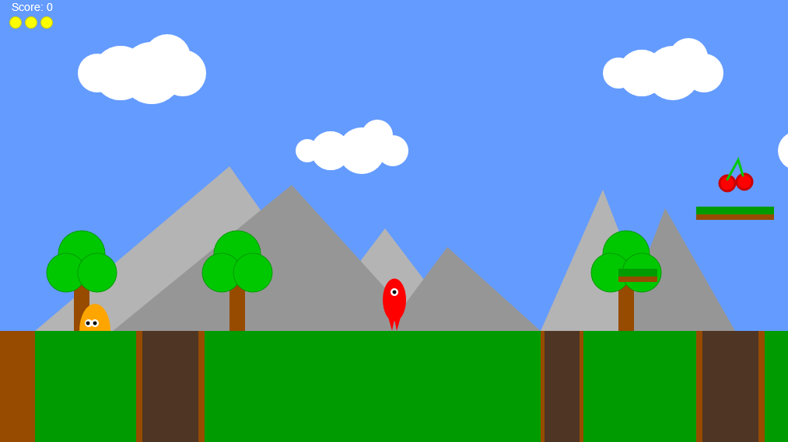

# Overview


The purpose of this game project is to practice some technical skills while creating a simple game using p5.js
library. The core functionalities include:
player interaction
environment interactions
score and lives counter
game over states

## Extensions

The extensions that were added to the game includes:

1. sound effects using p5.sound
2. platforms created with factory pattern
3. enemies created with constructor pattern

## Author's remarks

I think the most difficult part about this project was getting the logic of getting the character to fall between
the canyons. There were a lot of variables to consider when setting the character to fall between the canyons
like setting the character animation, checking the width of the canyons, and also checking the character's life
count/game over state. Overall, what I learned most from this project was just how much work there is to
game development. I had to practice a lot more of my googling skills, for sure on this project. Though it's a
small project and doesn't entail the full scope of game development, I found a better appreciation for the
work put into creating a single game from animations and game mechanics to sound

# How to run project

This project can be run with the game project's HTML file. Some examples to run the game project's HTML file on a local web server includes:

### [Live Server](https://marketplace.visualstudio.com/items?itemName=ritwickdey.LiveServer&ssr=false#overview)

If you have this extension installed then you can just open the project and click `Go Live` from the status bar to turn on the server.

### [http-server](https://github.com/http-party/http-server)

```
http-server
```

### python

```
python -m http.server
```
